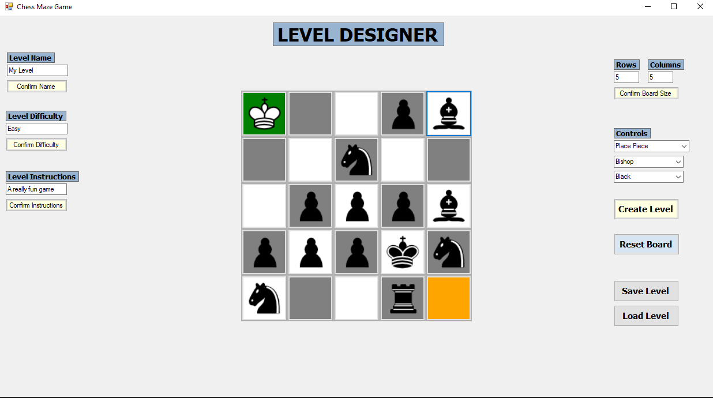

# Chess Maze Game

A Chess Maze Game Level Designer built in Visual Studio 2022 using Windows Forms and C#.

---

## Features

- Custom grid sizes
- Selection and placement of chess pieces
- Start and End position options
- Level descriptions

---

## How to Run the Game

1. Open in Visual Studio 2022
2. Press green 'Play' button up top
3. Create a custom Chess Maze game level

